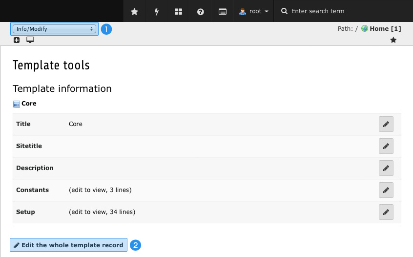
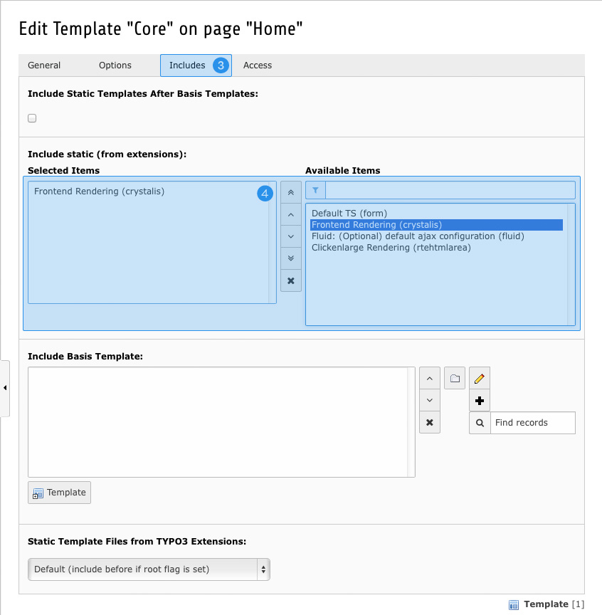

.. ==================================================
.. FOR YOUR INFORMATION
.. --------------------------------------------------
.. -*- coding: utf-8 -*- with BOM.

.. include:: ../../Includes.txt

.. _preset-rendering:

Content rendering
^^^^^^^^^^^^^^^^^

Crystalis provides its own content rendering logic and is intended to replace system extension *CSS Styled Content 
("css_styled_content")*. To not mess up with third party extension and stay as compatible as possible, the main 
structure of CSS Styled Content was adopted, thus implementing plugins works the same way.

Unlike most of the other features, content rendering is *not* loaded by default. You have to allocate this setup to 
your website template individually.

.. _preset-rendering-embed:

Embedding content rendering
"""""""""""""""""""""""""""

To make use of Crystalis' content rendering, you have to assign the render setup to the website templates of your 
choice.

To achieve this, head to the Template main module at first. Inside the page tree, select the page where you want the 
setup to feel responsible for rendering your content. In most cases this will be the home page of your website. If 
the chosen page does not contain any kind of template already, you may want to create a *"Template for a new site"* or 
an *"Extension Template"*.

Next ensure function *"Info/Modify"* **(1)** is selected and follow *"Edit the whole template record"* **(2)** at the
bottom.

Switch to *"Includes"* tab **(3)** and add item *"Frontend Rendering (crystalis)"* to *"Selected Items"* within
*"Include Static (from extensions)"* **(4)** section. After saving your changes, the render setup will take up
employment.

As soon as this had happened, Crystalis needs to know about the head domain of the respective page. Please see 
:ref:`preset-rendering-domains`.

.. _preset-rendering-cssstyledcontent:

Synergy with CSS Styled Content
"""""""""""""""""""""""""""""""

As mentioned before, the whole content rendering logic is intended to completely replace *CSS Styled Content*. If you do
not make use of this system extension any more (as recommended) you can safely uninstall it to not waste valuable
resources.

Anyways, if you still are contingent to this system extension, Crystalis runs fine beside *CSS Styled Content*. But keep 
in mind that both content rendering setups are clearing previous ones at the beginning – meaning you can't effectively 
run both content rendering setups simultaneously.

To deactivate *CSS Styled Content* simply head to Extension Manager module, search for *CSS Styled Content* and click
the minus-button next to it. Please do *not* physically remove this extension as this may lead to issues when trying to
update the TYPO3 core later on.

.. _preset-rendering-doctype:

Set up HTML doctype
"""""""""""""""""""

In some cases Crystalis needs to react to the document type of your website. For example it does not make sense to allow
the HTML5 Video element when XHTML 1.0 is used. As you may presume, the document type also affects content rendering –
as HTML5 provides some great ways to improve semantics of your site.

If not specified, Crystalis expects the document type to be *"HTML5"*. To switch to another type, head to Extension
Manager module, select *Crystalis* and change *"HTML Doctype"* inside *"Frontend Rendering"* tab. As of now, Crystalis
does support HTML5 and XHTML 1.0 Strict. This list may be expanded in future releases.

.. _preset-rendering-domains:

Basic domain settings
"""""""""""""""""""""

When a page is rendered, TYPO3 should know about the domain of the page. This gains in importance when the language 
service and/or RealURL is used. These settings are stored as constants inside your website template and therefore can 
easily been edited using the Constant Editor.

For this purpose switch to *"Template"* main module. Inside the page tree navigate to the page where the template is 
located in.

.. figure:: ../../Images/ContentRendering/DomainSettings.jpg
   :align: left
   :alt: Configuring domains

Next ensure function *"Constant Editor"* **(1)** is selected and choose category *"SERVER"* **(2)**. Fill out the fields 
below as described there and save your changes.

**Note:** If working with multiple sites you have to specify a domain for each of them.