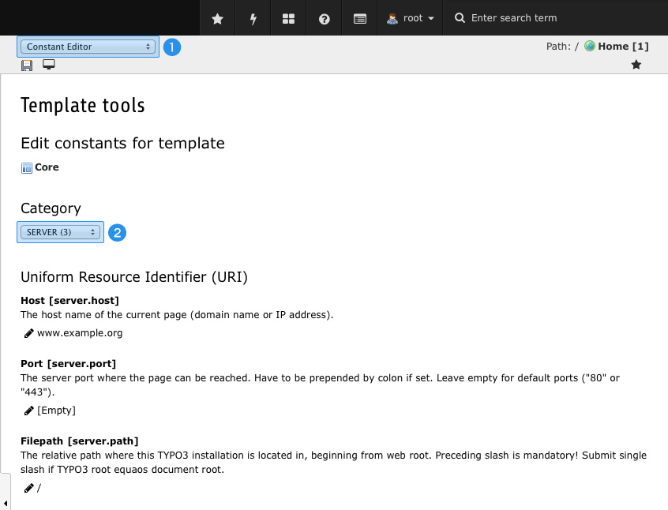

.. ==================================================
.. FOR YOUR INFORMATION
.. --------------------------------------------------
.. -*- coding: utf-8 -*- with BOM.

.. include:: ../Includes.txt

.. _configuration-presets:

Configuration Presets
=====================

Crystalis provides configuration presets which mainly optimize backend usability and HTML output. Most of them 
automatically are injected by default, but some of them have to be activated individually.

This chapter describes which configurations are concerned in particular and how they integrate into your system.
Please keep in mind, that final configuration highly is affected by the extensions load order. If some extensions 
are loaded after Crystalis, they may override parts of the provided conigurations. However, in most cases this is 
the desired behaviour and shouldn't irritate yourself.

.. _preset-page-ts:

Page TypoScript
---------------

The page configuration is automatically injected by default and supports you with an optimized Rich Text Editor 
configuration, purged backend forms and some preset values you may won't have to remember any more.

Do not worry about Crystalis changing the default style of your content elements. The preset values do not affect 
layouts, stylings or any kind of content – they preselect options which mainly are of technical nature. For 
example the default Extbase Frontend User Domain Model is allocated to frontend users. If this option is not set 
properly you may experience issues when trying to access frontent users using Extbase.

.. _preset-page-ts-deactivate:

Prevent injection of Page TypoScript
^^^^^^^^^^^^^^^^^^^^^^^^^^^^^^^^^^^^

If you still aren't comfortable with that or just want to write your own configurations from scratch, you simply 
can disable injection of Page TypoScript inside the TYPO3 Extension Manager – thus requiring you to have 
administrator rights.

To deactivate Page TypoScript, head to Extension Manager and select Crystalis. In General tab uncheck 
"Page TypoScript" in "Preset configurations" section and save your changes.

From now on, Crystalis will desist from loading Page TypoScript automatically.

.. _preset-user-ts:

User TypoScript
---------------

Similar to the page configuration, the user configuration is injected by default and makes some smaller adjustments 
to backend users. The configurations herein aren't very extensive and allow backend users to clear global cache for 
example. What may should taken into account is the circumstance, that Crystalis deactivates uploading of files 
directly inside content element forms, thus forcing users to make use of the filelist module.

.. _preset-user-ts-deactivate:

Refrain from User TypoScript
^^^^^^^^^^^^^^^^^^^^^^^^^^^^

If you don't want Crstalis to inject its backend user configuration, you can disable this feature inside TYPO3 
Extension Manager – thus requiring you to have administrator rights.

To deactivate User TypoScript, head to Extension Manager module and select Crystalis. In General tab uncheck 
"User TypoScript" in "Preset configurations" section and save your changes.

After this, the backend user configuration won't be touched by Crystalis anymore.

.. _preset-rendering:

Content rendering
-----------------

Crystalis provides its own content rendering logic and is intended to replace system extension CSS Styled Content 
("css_styled_content"). To not mess up with third party extension and stay as compatible as possible, the main 
structure of CSS Styled Content was adopted, thus implementing plugins the old fashioned way works the same way.

Unlike most of the other features, content rendering is *not* loaded by default. You have to allocate this setup to 
your website template individually.

.. _preset-rendering-embed:

Embedding content rendering
^^^^^^^^^^^^^^^^^^^^^^^^^^^

To make use of Crystalis' content rendering, you have to assign the render setup to the website templates of your 
choice.

To achieve this, firstly head to the Template main module. Inside the page tree, select the page where you want the 
setup to feel responsible for rendering your content. In most cases this will be the home page of your website. If 
the chosen page does not contain any kind of template already, firstly create a "Template for a new site" or an 
"Extension Template".

.. figure:: ../Images/ContentRendering/EditSiteTemplate.jpg
   :alt: Edit the template of your site

Next ensure function "Info/Modify" (1) is selected and follow "Edit the whole template record" (2) at the bottom.

.. figure:: ../Images/ContentRendering/IncludeStatic.jpg
   :alt: Include render template

Switch to "Includes" tab (3) and add item "Frontend Rendering (crystalis)" to "Selected Items" within "Include 
Static (from extensions)" (4) section. After saving your changes, the render setup will take up employment.

As soon as this had happened, Crystalis needs to know about the head domain of the respective page. See 
:ref:`preset-rendering-domains`.

.. _preset-rendering-cssstyledcontent:

Synergy with CSS Styled Content
^^^^^^^^^^^^^^^^^^^^^^^^^^^^^^^

As mentioned above, the whole content rendering logic is intended to completely replace CSS Styled Content. If you 
do not make use of this system extension any more (as recommended) you can savely uninstall it to not waste valuable 
resources.

Anyways, if you still are contingent to this system extension, Crystalis runs fine beside CSS Styled Content. But keep 
in mind that both content rendering setups are clearing previous ones at the beginning – meaning you can't effectively 
run both content rendering setups simultaneously.

To deactivate CSS Styled Content simply head to Extension Manager module, search for CSS Styled Content and click the 
minus-button next to it. Please do *not* phisically remove this extension as this may lead to issues when trying to 
update the TYPO3 core later on.

.. _preset-rendering-doctype:

Set up HTML doctype
^^^^^^^^^^^^^^^^^^^

In some cases Crystalis has to react to the doctype of your website. For example it does not make sense to allow the 
HTML5 Video element when XHTML 1.0 is used. As you may presume, the doctype also affects content rendering, as HTML5 
provides some great ways to improve semantics of your site.

If not specified, Crystalis expects the doctype to be "HTML5". To switch to another doctype, head to Extension Manager 
module, select Crystalis and change "HTML Doctype" inside "Frontend Rendering" tab. As of now, Crystalis does support 
HTML5 and XHTML 1.0 Strict. This list may be expanded in future releases.

.. _preset-rendering-domains:

Basic domain settings
^^^^^^^^^^^^^^^^^^^^^

When a page is rendered, TYPO3 should know about the domain of the page. This becomes more mandatory if the language 
service and/or RealURL is used. These settings are stored as constants inside your website template and therefore can 
easily been edited using the Constant Editor.

For this purpose switch to "Template" main module. Inside the page tree navigate to the page where the template is 
located in.

Next ensure function "Constant Editor" (1) is selected and choose category "SERVER" (2). Fill out the fields below as 
described there and save your changes.

**Note:** If working with multiple sites you have to specify a domain for each of them.