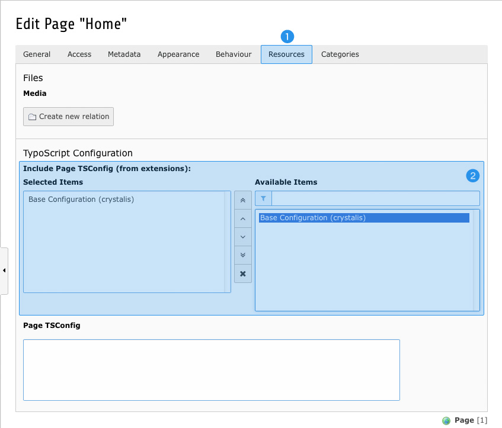

.. ==================================================
.. FOR YOUR INFORMATION
.. --------------------------------------------------
.. -*- coding: utf-8 -*- with BOM.

.. include:: ../../Includes.txt

.. _preset-page-ts:

Page TypoScript
^^^^^^^^^^^^^^^

The pre-defined Page TypoScript provides configurations for the *New Content Element Wizard*, optimizes the Rich Text
Editor and adjusts backend forms to increase usability.

Please be aware, that page configurations aren't loaded by default any more. To make use of them, you have to assign
them to the page(s) of your choice.

.. _preset-page-ts-embed:

Embedding Page TypoScript
"""""""""""""""""""""""""

From now on, page configurations have to be assigned to pages manually. This allows you to limit those configurations to
a subset of pages (and all of their sub-pages), leaving any other page untouched.

To achieve this, edit the page(s) of your choice:

Switch to *Resources* tab **(1)** and add *Base Configuration (crystalis)* to *Selected Items* within *Include Page
TSConfig (from extensions)* **(2)**.

After saving your changes the Page TypoScript will be loaded for this particular page and all of its sub-pages.