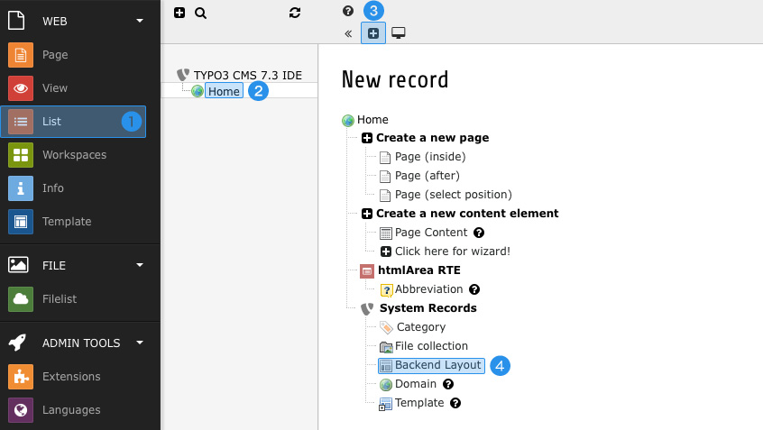
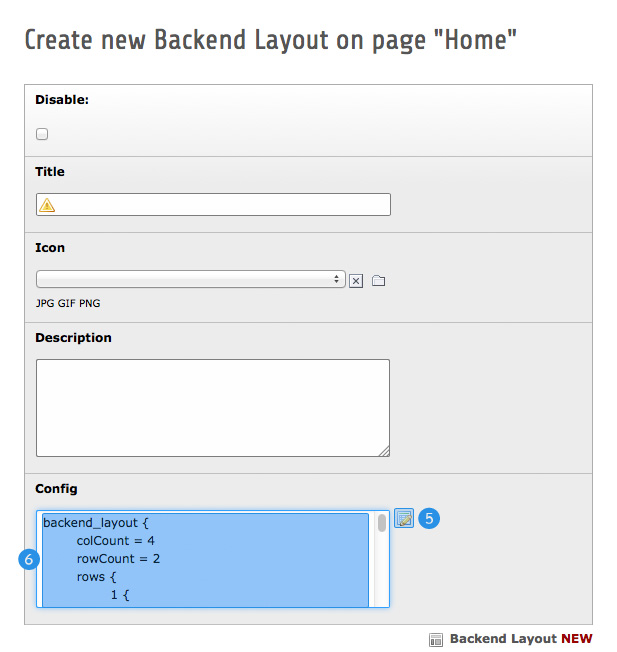

.. ==================================================
.. FOR YOUR INFORMATION
.. --------------------------------------------------
.. -*- coding: utf-8 -*- with BOM.

.. include:: ../../Includes.txt

.. _be-lay-new:

Creating new layouts
^^^^^^^^^^^^^^^^^^^^

The configuration options of outsourced backend layouts are exactly the same as those from layouts saved in 
database, thus exporting existing backend layouts is fairly easy.

When creating new backend layouts you can take advantage of the respective wizard supplied by TYPO3 CMS:

First of all, switch to List module **(1)** and select any page inside the page tree **(2)** but the very root page. 
Because you don't want the layout to be stored in database, it does'nt matter which page you're choosing exactly – 
you won't save the record at all.

Next click the button "Create new record" **(3)** and choose "Backend Layout" **(4)** from the list. You can 
completely ignore all fields inside the displayed form except the last one: "Config":

To make things a little easier, open the Backend Layout Wizard **(5)** and build up your layout as desired. After 
saving and closing the wizard, the "Config" field automatically will be filled with the configuration of your layout 
**(6)**.

Now what you have to do is to copy all the generated code and paste it into an empty TypoScript file. Abort the 
backend form for creating a new backend layout record to prevent it from being saved in database.

The TypoScript file you just created must be accessible for TYPO3 CMS, so please make sure it's located inside a 
directory on your server, which is reachable for PHP.