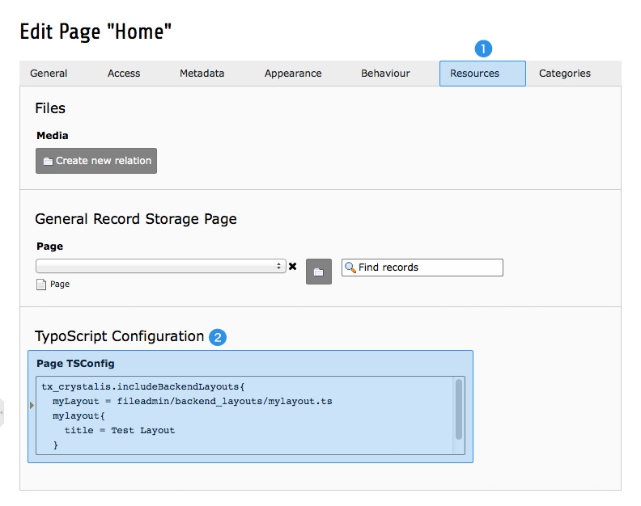

.. ==================================================
.. FOR YOUR INFORMATION
.. --------------------------------------------------
.. -*- coding: utf-8 -*- with BOM.

.. include:: ../../Includes.txt

.. _be-lay-register:

Registering layouts to be loaded
^^^^^^^^^^^^^^^^^^^^^^^^^^^^^^^^

To tell TYPO3 CMS to load an external backend layout, the layout has to be registered within PageTS configuration. 
Edit the page with the lowest level where you want to include your layout – in most cases this would be the home page:

Switch to *Resources* tab **(1)** and edit *Page TSConfig* **(2)** as follows:

.. _be-lay-register-setup:

tx_crystalis
""""""""""""

.. ### BEGIN~OF~TABLE ###

.. container:: table-row

   Property
         .. _be-lay-register-includebackendlayouts:

         includeBackendLayouts.[array]

   Data type
         resource

   Description
         Inserts one or more backend layouts.

         The file definition must be a valid "resource" data type, otherwise nothing is inserted. This means that 
         remote files cannot be referenced.

         Each file has *optional properties:*

         **.title:** Sets the name appearing in select fields. You can enter a localization string here.

         **.description:** Sets the description of the backend layout. Localization strings are supported here too.

         **.icon:** Specify an icon which should be displayed. Icon must be a valid "resource" data type.

         **Example:** ::

            tx_crystalis.includeBackendLayouts{
                mylayout = fileadmin/backend_layouts/mylayout.ts
                mylayout{
                    title = LLL:fileadmin/lang/locallang_be.xml:be_layout.mylayout_title
                    description = LLL:fileadmin/lang/locallang_be.xml:be_layout.mylayout_description
                    icon = fileadmin/icons/be_layout_mylayout.png
                }
            }

.. ###### END~OF~TABLE ######