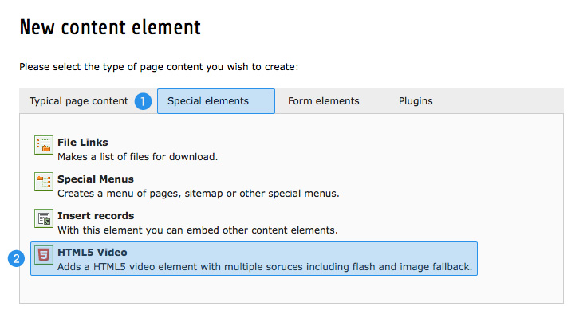
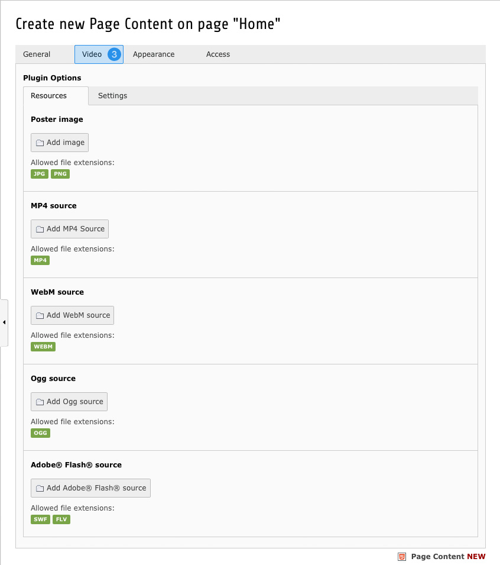

.. ==================================================
.. FOR YOUR INFORMATION
.. --------------------------------------------------
.. -*- coding: utf-8 -*- with BOM.

.. include:: ../../Includes.txt

.. _html5-video-add:

Adding a new element
^^^^^^^^^^^^^^^^^^^^

Embedding HTML5 videos doesn't differ much from adding common elements and only requires a few clicks. At first select
the page of your choice and create a new content element the way you are used to.

The HTML5 Video element is located in *"Special elements"* tab **(1)** and is named *"HTML5 Video"* **(2)**.

The form that is loaded after your selection is similar to any other element, but provides an additional tab called
*"Video"* **(3)**. The Options herein are self-explanatory and allow you to add various sources and change the
appearance of the element.

**Note:** The HTML5 Video content element requires at least one real video source (MP4, WebM, Ogg) to be set. If none
of them was added, nothing will be generated in the frontend. If you want to embed a flash-only element, please use the
Media content element instead.