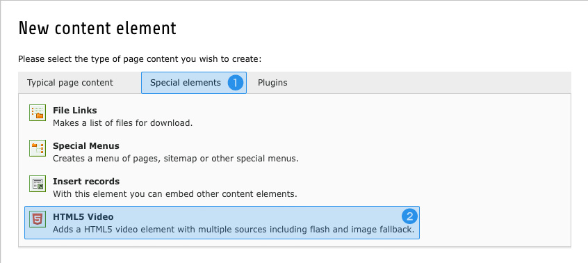

.. ==================================================
.. FOR YOUR INFORMATION
.. --------------------------------------------------
.. -*- coding: utf-8 -*- with BOM.

.. include:: ../Includes.txt

.. _html5-video:

The HTML5 Video content element
===============================

If HTML5 :ref:`doctype <preset-rendering-doctype>` is selected (which is by default) the Media content element 
will be substituted with the newly introduced HTML5 Video content element.

This new element allows you to place cross-plattform videos onto your website.

.. _html5-video-availability:

Availability
------------

As mentioned above, the HTML5 Video content element automatically will substitute the Media element if HTML5 
:ref:`doctype <preset-rendering-doctype>` was chosen. However, if you don't want to make use of this element 
(maybe because you're already using another third-party extension for this purpose), head to Extension Manager 
module, select Crystalis and check "Disable HTML5 video" in "Frontend Rendering" tab. After this the Media 
element will be back again.

But what to do if you absolutely want to make use of the HTML5 content element, but still need the Media element 
to be available (to embed flash-only videos for example)? Well, of course that's possible too, but you have 
to write a little TypoScript to achieve this. Technically the Media element won't be overwritten in any way, 
but it will be hidden instead. To reactivate the Media content element just add this line of TypoScript to 
your PageTS configuration:

:typoscript:`mod.wizards.newContentElement.wizardItems.special.show := addToList(media)`

That's it. Now you are able to make use of the HTML5 video element and the Media element as well.

**Note:** If you're adding your configuration using a custom extension, please ensure it will be loaded after 
Crystalis by making it dependend on Crystalis in *ext_emconf.php*. Otherwise your settings won't have any effect 
on available content elements.

.. _html5-video-add:

Adding a new element
--------------------

Embedding HTMl5 videos doesn't differ much from adding common elements and only requires a few clicks. Firstly 
select the page of your choice and create a new content element the way you are used to.

The HTML5 Video element is located in "Special elements" tab **(1)** and is named "HTML5 Video" **(2)**.

.. figure:: ../Images/Html5Video/VideoTab.jpg
   :alt: The Video tab inside HTML5 Video content element

The form that is loaded after your selection is similar to any other element, but provides an additional tab 
called "Video" **(3)**. The Options herein are self-explanatory and allow you to add various sources and change 
the appearance of the element. Altough all settings are optional, it is highly recommended to define width and 
height of the video. If omitted an auto-detection algorithm tries to extract the dimensions of your sources but 
this does not work very well in current release.

**Note:** The HTML5 Video content element requires at least one real video source (MP4, WebM, Ogg) to be set. If 
none of them was added, nothing will be generated in the frontend. If you want to embed a flash-only element, 
please use the Media content element instead.

.. _html5-video-ts:

The TypoScript way
------------------

After a HTML5 Video content element was placed onto a page, it will be rendered using the brand new 
:ref:`cobj-video` content object. You can take advantage of this circumstance to embed HTML5 videos with only a 
few lines of TypoScript – without the need of any content element. This is particularly beneficial if you want 
to display static videos which never should be maintained by backend users.

This method works in every environment, regardless of wheter the HTML5 Video content element is 
:ref:`available <html5-video-availability>` or not – allowing you to embed HTML5 videos even when working with 
XHTML 1.0 Strict :ref:`doctype <preset-rendering-doctype>`.

**Note:** Like the content element itself, the :ref:`cobj-video` content object requires at least one out of the 
three main video formats (MP4, WebM, Ogg) to be set. Otherwise nothing will be generated in frontend.