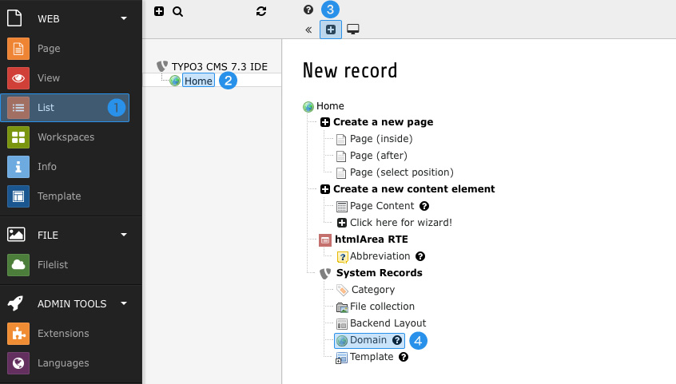
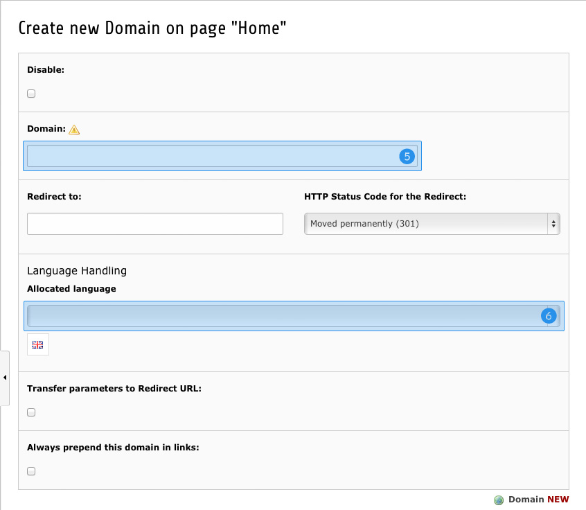

.. ==================================================
.. FOR YOUR INFORMATION
.. --------------------------------------------------
.. -*- coding: utf-8 -*- with BOM.

.. include:: ../../Includes.txt

.. _lang-domains:

Handling domains
^^^^^^^^^^^^^^^^

When making use of the Language Service, a proper handling of domains becomes more important. Every domain which 
should be handled by TYPO3 should be catched by exactly one domain record within the whole site.

Creating domain records works as follows:

Switch to *List* module **(1)** and select the supposed root page of your domain **(2)**. Press the *"Create new 
record"* **(3)** button at the top and choose *"Domain"* **(4)**. The domain record itself consits of two important 
fields: 

Of course the most important one is the domain itself **(5)**. Please enter the domain name only (no 'http' or 
slashes) – including subdomain if any (e.g. 'www.example.org').

If you want a specific language to be loaded when the domain is called, please select an *"Allocated language"* **(6)**.

Don't forget to save and repeat those steps with all domains you want to handle via TYPO3 CMS.

**Note:** RealUrl has got some issues when alternative ports are used. If you're using non-standard ports (unlike 
'80', '8080' or '443') you have to create two records – one containing the port inside the domain name (e.g. 
'www.example.org:8888') and one not. Some further informations about this issue can be found in chapter 
:ref:`Known Problems <problems-domain-ports>`.